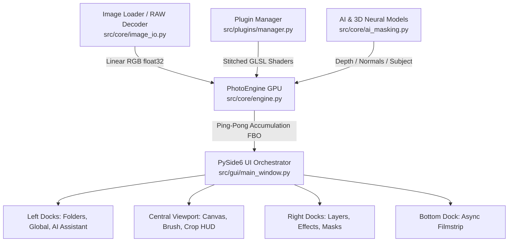

# Lumens Deep 📸✨

[](https://www.python.org/downloads/)
[](https://pypi.org/project/PySide6/)
[](https://github.com/moderngl/moderngl)
[](LICENSE)
[](https://lumensdeep.com/)
[](docs/ARCHITECTURE.md)

<!-- SCREENSHOT PLACEHOLDER: docs/images/hero_preview.png -->
> 📸 **Screenshot Needed (Hero Banner):** `docs/images/hero_preview.png`  
> *Description: Full aesthetic screenshot of Lumens Deep running with an open high-res RAW portrait/landscape, active filmstrip, layers panel, and color grading in progress.*

**Lumens Deep** is an open-source, non-destructive 32-bit floating-point RAW photo editor and 3D neural relighting studio built with **Python**, **ModernGL**, and **PySide6**. It combines modern computational photography, high-performance GPU shaders, neural 3D scene estimation (Depth, Surface Normals, Alpha Matting), and an extensible plugin architecture.

🌐 **Official Website:** [https://lumensdeep.com](https://lumensdeep.com/)

---

## 🌟 Key Features

- **🚀 32-Bit Linear Floating-Point GPU Engine**:
  - Full non-destructive RAW sensor decoding (Canon `.CR3`/`.CR2`, Nikon `.NEF`, Sony `.ARW`, Fuji `.RAF`, `.DNG`).
  - Hardware-accelerated ModernGL FBO accumulation pipeline with zero quality loss.
  - Perceptually uniform **OKLab / OKLCH** color management and sRGB OETF transfer curves.

- **✨ 3D Depth & Cinematic Bokeh Raymarching**:
  - Progressive Monte Carlo depth raymarching for genuine optical depth-of-field simulation.
  - Configurable aperture blades ($3$ to $12$ blades or smooth circular iris).
  - Optical cat-eye vignetting, chromatic aberration, specular highlight boost, and swirly Petzval distortion.
  <!-- SCREENSHOT PLACEHOLDER: docs/images/readme_bokeh_showcase.png -->
  > 📸 **Screenshot Needed:** `docs/images/readme_bokeh_showcase.png`  
  > *Description: Split-wipe comparison or side-by-side demonstrating the realistic 3D Bokeh blur simulation.*

- **🤖 Offline Neural AI Scene Estimation**:
  - Automatic map discovery from `LumenDeep/` subfolders (`_depth.png`, `_normals.png`, `_subject.png`).
  - Async multi-threaded background estimation for Metric Depth, High-Frequency Surface Normals, and Subject Alpha Matting.
  - Fast-path keyboard visualizers for 3D Depth (`D`), Surface Normals (`N`), Subject Mask (`S`), and Layer Mask (`M`).
  <!-- SCREENSHOT PLACEHOLDER: docs/images/readme_ai_maps.png -->
  > 📸 **Screenshot Needed:** `docs/images/readme_ai_maps.png`  
  > *Description: 4-quadrant preview showing Original Photo, Depth Map, Surface Normal Map, and Subject Matting Alpha Mask.*

- **🧩 Community Plugin Architecture**:
  - Modular effect plugin system: every tool is an isolated plugin inheriting from `BaseEffectPlugin`.
  - Dynamic GLSL shader code stitching and instant hot-reloading.
  - Built-in plugins: **Basic Adjustments**, **Tone Equalizer** (8-band OKLCH curve), **Color Equalizer**, and **Shadow Color Equalizer**.

- **🎯 Multi-Layer Precision Masking**:
  - **GPU Brush Painting**: Sub-pixel stroke interpolation for silky-smooth drawing without gaps on rapid sweeps.
  - **Parametric Color & Luma Masks**: Target specific OKLCH hues, brightness zones, and saturation ranges.
  - **3D Geometric Masks**: Isolate objects by 3D depth intervals or 3D surface orientations for directional relighting.
  - **Gradient Masks**: Linear (4 directions) and Radial gradients with gamma controls.

- **📐 Interactive Canvas & Viewport**:
  - Interactive Crop & Straighten HUD with Rule of Thirds guidelines and corner rotation brackets.
  - Comparison Modes: **Before/After toggle (`\`)**, **Vertical Split Wipe**, **Horizontal Split**, and **Side-by-Side**.
  - Async Filmstrip with caching and multi-threaded folder scanning.

---

## 🏗️ Architecture Overview

Lumens Deep is organized around **Clean Architecture** principles to separate core computations from the UI presentation layer:



For complete technical documentation, see [Architecture & Plugin Development Guide](docs/ARCHITECTURE.md).

---

## ⚡ Quick Start

### 1. Clone & Install Dependencies
```bash
git clone https://github.com/your-username/LumensDeep.git
cd LumensDeep

# Install requirements
pip install -r requirements.txt
```

### 2. Launch the Application
```bash
python src/gui/main_window.py
```

---

## 🔌 Writing a Custom Plugin in 5 Minutes

To add a new photo adjustment effect, create a Python file in `src/plugins/builtin/` (or your community plugin folder) subclassing `BaseEffectPlugin`:

```python
from src.plugins.base import BaseEffectPlugin
from PySide6.QtWidgets import QWidget, QVBoxLayout, QSlider, QLabel
from PySide6.QtCore import Qt

class FilmWarmthPlugin(BaseEffectPlugin):
    @property
    def plugin_id(self) -> str:
        return "film_warmth"

    @property
    def display_name(self) -> str:
        return "Film Warmth"

    @property
    def category(self) -> str:
        return "Color"

    def get_default_settings(self):
        return {'warmth': 0}

    def get_glsl_uniforms(self) -> str:
        return "uniform float u_film_warmth;\n"

    def get_glsl_execution(self) -> str:
        return """
        if (u_film_warmth != 0.0) {
            vec3 oklch = oklab_to_oklch(linear_srgb_to_oklab(linear_rgb));
            oklch.z += u_film_warmth * 0.2; // shift hue angle
            linear_rgb = oklab_to_linear_srgb(oklch_to_oklab(oklch));
        }
        """

    def apply_uniforms(self, program, settings, engine):
        if 'u_film_warmth' in program:
            val = settings.get('warmth', 0) / 100.0
            program['u_film_warmth'].value = float(val)

    def create_widget(self, parent, on_changed):
        w = QWidget(parent)
        layout = QVBoxLayout(w)
        slider = QSlider(Qt.Horizontal)
        slider.setRange(-100, 100)
        slider.valueChanged.connect(on_changed)
        w.slider = slider
        layout.addWidget(QLabel("Warmth:"))
        layout.addWidget(slider)
        return w

    def get_state(self, widget):
        return {'warmth': widget.slider.value()}

    def set_state(self, widget, state):
        widget.slider.setValue(state.get('warmth', 0))

    def reset_state(self, widget):
        self.set_state(widget, self.get_default_settings())
```
Restart the app — your new plugin is automatically discovered, registered in the UI, and compiled into the GPU shader pipeline!

---

## ⌨️ Essential Keyboard Shortcuts

| Shortcut | Description |
| :--- | :--- |
| `Ctrl + O` / `Ctrl + S` / `Ctrl + E` | Open Photo / Save Sidecar / Export Image |
| `Ctrl + 0` / `Ctrl + 1` | Fit to Viewport / Zoom to 100% (1:1) |
| `Ctrl + Shift + D/N/S/A` | Compute Depth / Normals / Subject / All AI Maps |
| `D` / `N` / `S` / `M` | Toggle 3D Depth / Normals / Subject / Layer Mask Visualizers |
| `B` | Toggle GPU Brush Mask Tool |
| `C` | Toggle Interactive Crop & Straighten |
| `\` | Toggle Before / After View |

See full list in [Keyboard Shortcuts Reference](docs/SHORTCUTS.md).

---

## 📚 Documentation Index

- 🌐 **[Official Website & Interactive Demos](https://lumensdeep.com)**: Interactive Before/After split viewer, 3D map explorer, and live Bokeh aperture visualizer.
- 📖 **[User Guide & Manual](docs/USER_GUIDE.md)**: Full guide covering all features and workflows.
- 📐 **[Software Architecture & Plugin Guide](docs/ARCHITECTURE.md)**: Deep dive into the engine, FBO pipeline, and plugin API.
- ⌨️ **[Keyboard Shortcuts Cheat Sheet](docs/SHORTCUTS.md)**: Quick reference table for all shortcuts.
- 🔬 **[Scientific Bokeh Raymarch Algorithm](docs/Scientific_Bokeh_Algorithm.md)**: Theory and mathematics behind 3D depth raymarch bokeh.
- 🧊 **[3D Depth & Normal Estimation](docs/Scientific_Depth_And_Normals_Algorithm.md)**: High-resolution surface normal and depth estimation pipelines.

---

## 👨‍💻 Meet the Creator

**Lumens Deep** was designed and engineered by **[Volodymyr Makovetskyi](https://github.com/3dcarrots)**:
- ⚡ **Lead Developer at [3DCoat](https://3dcoat.com/)** — Industry-standard 3D voxel sculpting, retopology, and texturing software.
- 🔬 **Creator of [Scanimat](https://scanimat.com/)** ([scanimate.io](https://scanimate.io/)) technology.
- ⏳ **20+ Years in 3D Computer Graphics** — Developing commercial 3D algorithms and rendering engines since the late 1990s.

> *"I created Lumens Deep to bridge the divide between flat 2D RAW photos and true 3D spatial geometry. Every photo should be treated as a live 3D scene where each pixel possesses metric depth and surface orientation — empowering both human photographers and autonomous AI agents (via MCP) to perform non-destructive, authentic edits without synthetic hallucination."*

Connect & follow the project:
- 🐙 **GitHub:** [@3dcarrots](https://github.com/3dcarrots)
- 📺 **YouTube:** [@3dcarrots](https://www.youtube.com/@3dcarrots)
- 💼 **LinkedIn:** [Volodymyr Makovetskyi](https://www.linkedin.com/in/volodymyr-makovetskyi-212531177/)
- 🌐 **Scanimat:** [scanimat.com](https://scanimat.com/)

---

## 📄 License

This project is licensed under the **MIT License** — see the [LICENSE](LICENSE) file for details.
Compatible with all underlying libraries (`PySide6`, `rawpy`, `lensfunpy`, `ModernGL`, `ONNXRuntime`, `Torch`).

