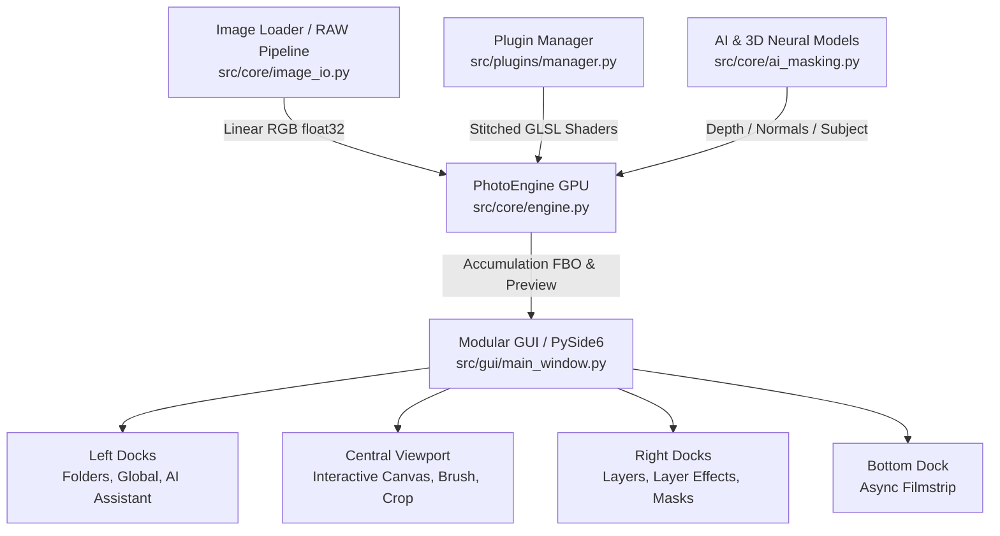

# Lumens Deep: Software Architecture & Plugin Development Guide

This document provides a comprehensive architectural overview of **Lumens Deep**, detailing its modular design, clean-architecture principles, source code structure, rendering pipeline, and instructions for developing custom effect plugins.

---

## 1. High-Level Architectural Overview

Lumens Deep is built with a **Clean, Modular, and Extensible Architecture** designed for non-destructive 32-bit floating-point image and RAW photo editing.



### Core Architectural Principles:
1. **Separation of Concerns (SoC)**:
   - **`src/core/`**: Pure computation, OpenGL/ModernGL GPU processing, file I/O, and neural AI estimation. Zero dependency on GUI layout.
   - **`src/plugins/`**: Modular community and built-in effect plugins. Plugins define their own UI, GLSL shader code, parameters, and serialization.
   - **`src/gui/`**: PySide6 presentation layer decomposed into independent docks, custom spline widgets, and viewport canvases.
   - **`src/shaders/`**: Reusable GLSL 330 core shaders for blending, raymarching, geometry transformations, and brush rasterization.
2. **Non-Destructive Layer Stack**: All adjustments operate on 32-bit float linear color buffers. Original RAW sensor data remains untouched in memory while individual layers apply local parametric, gradient, 3D geometric, or hand-painted masks.
3. **Hardware Acceleration via ModernGL**: Real-time rendering leverages OpenGL 3.3+ Framebuffer Objects (FBOs), ping-pong accumulation buffers, and compute-like fragment shaders.
4. **Community-Driven Plugin System**: Any developer can drop a single Python file into the plugins directory to introduce new photographic filters with full GPU shader acceleration.

---

## 2. Directory & Source Code Structure

```
LumensDeep/
├── docs/                                  # Documentation and architectural guides
│   ├── ARCHITECTURE.md                    # System architecture & plugin guide
│   ├── Scientific_Bokeh_Algorithm.md      # Raymarch bokeh documentation
│   ├── Scientific_Depth_And_Normals.md    # Neural 3D map algorithms
│   └── Alpha_Mask_Generation.md           # Matting & segmentation documentation
├── models/                                # Pretrained AI model weights
│   ├── depth_anything_v2_vits.onnx        # Metric / relative depth estimation
│   ├── surface_normals.onnx               # High-resolution surface normals
│   └── bria_rmbg_1.4.onnx                 # Subject matting & alpha segmentation
├── scratch/                               # Automated test scripts & validation suite
├── src/
│   ├── core/                              # Core processing engine & I/O
│   │   ├── engine.py                      # PhotoEngine: GPU pipeline, FBOs, Bokeh, Brush
│   │   ├── image_io.py                    # RAW/CR3 decoding, EXIF metadata extraction
│   │   └── ai_masking.py                  # AI neural estimation for Depth/Normals/Subject
│   ├── gui/                               # PySide6 User Interface
│   │   ├── docks/                         # Independent dockable widgets
│   │   │   ├── folders_dock.py            # Hierarchical directory tree dock
│   │   │   ├── global_dock.py             # Global lens, 3D bokeh & output dock
│   │   │   ├── ai_dock.py                 # AI neural map computation dock
│   │   │   ├── layers_dock.py             # Multi-layer management dock
│   │   │   ├── layer_effects_dock.py      # Host for active layer plugin widgets
│   │   │   ├── mask_dock.py               # Parametric, 3D & gradient masking dock
│   │   │   └── filmstrip_dock.py          # Bottom image filmstrip container
│   │   ├── widgets/                       # Specialized viewport & toolbar widgets
│   │   │   ├── viewport.py                # ImagePreviewLabel with interactive HUD
│   │   │   └── toolbar.py                 # Viewport top toolbar & brush settings bar
│   │   ├── folder_tree_widget.py          # Custom filesystem tree model
│   │   ├── filmstrip_widget.py            # High-performance async thumbnail strip
│   │   ├── spline_widget.py               # Interactive Bezier/Hermite LUT curve editor
│   │   ├── theme.py                       # Dark sleek UI stylesheet & theme tokens
│   │   └── main_window.py                 # Thin coordinator window & worker threads
│   ├── plugins/                           # Modular Layer Effect Plugin System
│   │   ├── base.py                        # BaseEffectPlugin abstract interface
│   │   ├── manager.py                     # PluginManager: dynamic loader & GLSL stitcher
│   │   └── builtin/                       # Built-in modular effect plugins
│   │       ├── basic_adjustments.py       # Exposure, Contrast, Denoise, Sharpen, etc.
│   │       ├── tone_equalizer.py          # 8-band OKLCH tone equalizer
│   │       ├── color_equalizer.py         # 8-band OKLCH color & saturation equalizer
│   │       └── shadow_color_eq.py         # Dedicated shadow hue/saturation equalizer
│   ├── shaders/                           # GLSL shader source files
│   │   ├── vertex.glsl                    # Geometry transformation & MVP vertex shader
│   │   ├── fragment.glsl                  # Dynamic fallback/base fragment shader
│   │   ├── mask_blend.glsl                # Layer accumulation & multi-mask blending
│   │   ├── brush.glsl                     # GPU brush mask stamp rasterizer
│   │   ├── blur_brush.glsl                # In-place mask boundary blur shader
│   │   ├── bokeh_raymarch.glsl            # Monte Carlo 3D depth raymarch bokeh shader
│   │   ├── preview_map.glsl               # Fast-path 3D depth/normals/mask preview
│   │   └── lens_correction.glsl           # Lensfun subpixel geometric/TCA distortion
│   └── mcp_server.py                      # Model Context Protocol server for AI pair-coding
├── requirements.txt                       # Python dependencies
└── .env                                   # Environment configuration
```

---

## 3. Core Subsystems

### 3.1. The GPU Rendering Pipeline (`src/core/engine.py`)

The rendering engine is organized around **ModernGL** framebuffer objects (FBOs):

1. **Source Texture (`self.texture`)**: 4-channel 32-bit float texture containing the linear sensor/RGB data.
2. **Layer Rendering (`layer_fbo`)**: Each active layer runs its dynamically generated GLSL fragment shader (stitched from active plugins) with local adjustment parameters.
3. **Accumulation & Mask Blending (`mask_blend.glsl`)**:
   - Operates on ping-pong FBOs (`accum_1` and `accum_2`).
   - Blends `layer_fbo` onto the accumulation buffer using a composite alpha mask calculated from:
     $$\text{Final Mask} = \text{Brush Mask} \times \text{Parametric Mask (Luma/Hue/Sat)} \times \text{Gradient Mask} \times \text{3D Depth Mask} \times \text{3D Normal Mask} \times \text{Layer Opacity}$$
4. **Cinematic 3D Bokeh Simulation (`bokeh_raymarch.glsl`)**:
   - Uses progressive Monte Carlo raymarching over the 3D depth map.
   - Features Vogel spiral sampling, polygonal aperture blades (3 to 12 blades or circular), optical cat-eye vignetting, chromatic aberration, and foreground/background gamma curves.
5. **Presentation Pass**:
   - Renders split comparisons (Vertical, Horizontal, Side-by-Side wipe) or Before/After modes.
   - Reads pixels to viewport with sRGB Transfer Function (OETF) applied on the CPU.

### 3.2. Coordinate Systems & Brush Painting

| Coordinate System | Origin | Range | Usage |
| :--- | :--- | :--- | :--- |
| **Qt Viewport Screen** | Top-Left | `x: [0, W]`, `y: [0, H]` | Mouse events, HUD overlay painting |
| **OpenGL NDC** | Center | `x: [-1.0, 1.0]`, `y: [-1.0, 1.0]` | Vertex positions, clipping space |
| **Image UV** | Top-Left (Memory) | `u: [0.0, 1.0]`, `v: [0.0, 1.0]` | Texture sampling, brush coordinates |

- **Stroke Interpolation (`paint_brush_stroke`)**: When dragging quickly across the viewport, discrete Qt mouse events are interpolated with a spacing of $15\%$ of the brush radius, ensuring continuous and solid lines without gaps or stepping.

---

## 4. How to Write a Custom Effect Plugin

The plugin architecture allows anyone to add new editing capabilities without touching the core engine.

### 4.1. Plugin Lifecycle

1. **Discovery**: `PluginManager` scans `src/plugins/builtin/` and external plugin directories for classes inheriting from `BaseEffectPlugin`.
2. **Shader Stitching**: `PluginManager.build_fragment_shader()` collects uniforms, helper functions, and execution blocks from all active plugins in sorted `order`, compiling a single optimized GLSL shader.
3. **UI Integration**: `LayerEffectsDock` dynamically instantiates the plugin's UI widget and nests it inside an expandable title card.
4. **Parameter Binding**: On every frame, `apply_uniforms()` writes the layer's current state to the compiled shader program.

### 4.2. Base Class Interface (`src/plugins/base.py`)

Every plugin must subclass `BaseEffectPlugin`:

```python
from abc import ABC, abstractmethod
from typing import Dict, Any
from PySide6.QtWidgets import QWidget
from src.plugins.base import BaseEffectPlugin

class CustomPlugin(BaseEffectPlugin):
    @property
    def plugin_id(self) -> str:
        """Unique key used in layer settings dictionaries."""
        return "my_custom_filter"

    @property
    def display_name(self) -> str:
        """Name shown in UI cards and menus."""
        return "Film Grain & Warmth"

    @property
    def category(self) -> str:
        """Grouping: 'Tone', 'Color', 'Detail', or 'Effects'."""
        return "Effects"

    @property
    def order(self) -> int:
        """Pipeline execution sequence (e.g. 100=Tone, 200=Color, 300=Detail, 400=Effects)."""
        return 400

    @property
    def icon(self) -> str:
        """Emoji or icon displayed on the title card."""
        return "🎞️"

    def get_default_settings(self) -> Dict[str, Any]:
        """Default dictionary of parameter values."""
        return {
            'grain_amount': 0,    # 0 to 100%
            'warmth': 0,          # -100 to 100
        }

    def get_glsl_uniforms(self) -> str:
        """Declare GLSL uniform variables needed by your effect."""
        return """
        uniform float my_grain_amount;
        uniform float my_warmth;
        """

    def get_glsl_functions(self) -> str:
        """Declare helper functions in GLSL."""
        return """
        float hash_noise(vec2 co) {
            return fract(sin(dot(co, vec2(12.9898, 78.233))) * 43758.5453);
        }
        """

    def get_glsl_execution(self) -> str:
        """
        Pixel processing logic.
        Available variables:
          - `linear_rgb` (vec3): current linear RGB color of the pixel.
          - `uv` (vec2): normalized texture coordinates [0, 1].
        """
        return """
        // 1. Apply Warmth in OKLCH
        if (my_warmth != 0.0) {
            vec3 oklch = oklab_to_oklch(linear_srgb_to_oklab(linear_rgb));
            oklch.z += my_warmth * 0.2; // shift hue
            linear_rgb = oklab_to_linear_srgb(oklch_to_oklab(oklch));
        }

        // 2. Add Film Grain
        if (my_grain_amount > 0.0) {
            float noise = (hash_noise(uv * 1000.0) - 0.5) * my_grain_amount * 0.1;
            linear_rgb += vec3(noise);
        }
        """

    def apply_uniforms(self, program: Any, layer_settings: Dict[str, Any], engine: Any) -> None:
        """Upload parameter values to OpenGL program uniforms before rendering."""
        defaults = self.get_default_settings()
        s = {**defaults, **layer_settings}

        if 'my_grain_amount' in program:
            program['my_grain_amount'].value = float(s['grain_amount'] / 100.0)
        if 'my_warmth' in program:
            program['my_warmth'].value = float(s['warmth'] / 100.0)

    def create_widget(self, parent: QWidget, on_changed_callback) -> QWidget:
        """Create PySide6 UI controls for the plugin."""
        container = QWidget(parent)
        layout = QVBoxLayout(container)
        # Create QSliders, QLabels, etc., and connect valueChanged to on_changed_callback
        return container

    def get_state(self, widget: QWidget) -> Dict[str, Any]:
        """Read UI control values into a dictionary."""
        return {
            'grain_amount': widget.slider_grain.value(),
            'warmth': widget.slider_warmth.value(),
        }

    def set_state(self, widget: QWidget, state: Dict[str, Any]) -> None:
        """Apply state dictionary values to the UI controls."""
        widget.slider_grain.setValue(state.get('grain_amount', 0))
        widget.slider_warmth.setValue(state.get('warmth', 0))

    def reset_state(self, widget: QWidget) -> None:
        """Reset all UI controls to default values."""
        self.set_state(widget, self.get_default_settings())
```

---

## 5. AI & 3D Neural Maps Architecture

Lumens Deep includes a fully integrated offline neural inference engine (`src/core/ai_masking.py`):

1. **Automatic Map Discovery (`LumenDeep/`)**:
   - When loading an image (e.g. `photos/sample.CR3`), the application automatically checks for pre-computed maps in `photos/LumenDeep/`:
     - `{stem}_depth.png` $\rightarrow$ Neural Depth Map
     - `{stem}_normals.png` $\rightarrow$ High-Frequency Surface Normals
     - `{stem}_subject.png` $\rightarrow$ Alpha Matting Subject Mask
2. **Background Async Generation**:
   - Users can trigger depth, normal, or subject mask estimation via the **`AI & 3D Tools`** menu or the **`AI Assistant Dock`**.
   - Computation runs in a dedicated `AIMapWorkerThread(QThread)` with non-blocking progress updates and tile reporting.
3. **Interactive 3D Geometry Masking**:
   - Layers can be masked by depth intervals ($\text{min}$ to $\text{max}$ depth) or surface orientations (normal vector $\vec{N}$ and angular tolerance), enabling relighting and background separation without manual rotoscoping.
4. **Keyboard Shortcuts for Neural Visualizers**:
   - `D`: Toggle 3D Depth Map visualizer
   - `N`: Toggle Surface Normal Map visualizer
   - `S`: Toggle Subject / Background Mask visualizer
   - `M`: Toggle Layer Mask overlay

---

## 6. Model Context Protocol (MCP) Integration

Lumens Deep embeds a lightweight **Model Context Protocol** server (`src/mcp_server.py`):
- Provides standardized JSON-RPC tools and state inspection for autonomous AI agents and coding assistants.
- Exposes tools to query image metadata, trigger neural estimations, adjust layer parameters, and export rendered assets programmatically.

---

## 7. Development & Verification Workflow

### Running Automated Test Suites
Run the following test scripts from the workspace root to verify system integrity:

```bash
# 1. Test AI neural maps loading and preview pipeline
python scratch/test_ai_maps_pipeline.py

# 2. Test 3D Bokeh raymarch optical blur and highlight boost
python scratch/test_bokeh_simulation_effect.py

# 3. Test GPU brush mask painting, erasing, and clearing
python scratch/test_brush_painting.py

# 4. Test brush stroke interpolation under rapid mouse movements
python scratch/test_brush_fast_stroke_interpolation.py

# 5. Test dock layout constraints, tab orders, and parameter bindings
python scratch/test_bokeh_and_dock_layout.py
```

---

## 8. Summary of Extension Points

| Subsystem | Extension Point | Primary File |
| :--- | :--- | :--- |
| **New Effect Filter** | Implement `BaseEffectPlugin` | Drop file into `src/plugins/builtin/` |
| **New AI Model** | Add ONNX model & wrapper | `src/core/ai_masking.py` |
| **New UI Dock Panel** | Subclass `QDockWidget` | Add to `src/gui/docks/` and wire in `main_window.py` |
| **New RAW Decoder / Format** | Add reader fallback | `src/core/image_io.py` |
| **New Shader Pass** | Add GLSL program & FBO | `src/shaders/` and `src/core/engine.py` |
